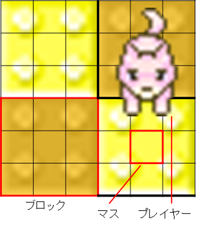

# JavaChallenge2015

## オンライン対戦サーバ

http://arena.ai-comp.net:3333/

## 概要

床を落として敵を落とせ！

## ルール

6ブロックx6ブロックの盤面上を動き、攻撃で向いている方向の一列のブロック（床）を落とすことが出来ます。
ブロックごと相手を落とし、最後まで生き残っていたプレイヤーが勝者となります。

### 初期状態

プレイヤーは4人です。各プレイヤーにはそれぞれ、0, 1, 2, 3 のIDが割り振られます。

各プレイヤーの初期位置と向きはランダムに決定されます。各プレイヤー間のマンハッタン距離が3以下にならないように配置されます。

### 盤面

盤面は、18マス×18マスで構成されます。
より正確には、3マス×3マスで構成された**ブロック**が、6ブロック×6ブロック並んで盤面を構成します。

### プレイヤー

プレイヤーは、1マス×1マスのマス目上に存在し、上下左右のいずれかの方向を向いています。

### ターンの流れ

ゲームはID0のプレイヤーから開始され、ID0->ID1->ID2->ID3->ID0->... の順にターンが進み、ゲームが進行していきます。

自分のターンになると、各プレイヤーの位置情報および盤面の状態が与えられます。
プレイヤーは毎ターン、以下のいずれかの行動を1つだけ取ることができます。
- 上下左右のいずれかの方向に1マス移動する
- 向いている方向に攻撃する
- 何もしない

#### 移動

移動を行うと、上下左右いずれかの方向に**1マス**移動することができます。
移動後、プレイヤーの向きは移動した方向になります。

#### 移動のキャンセル

次の場合、移動はキャンセルされ、向きの変更のみが行われます。
- フィールドの外へ移動しようとした場合
- すでに落下しているブロックに移動しようとした場合
- 他のプレイヤーとのマンハッタン距離が3以下となるような移動を行った場合

#### 攻撃

攻撃すると、プレイヤーが向いている方向のブロック一列を数ターン後に落下させます。
プレイヤーのいるブロックの隣にあるブロックは次の自分のターン(4ターン後)に落下、
2つ隣のブロックは次の次の自分のターン(8ターン後)に落下というように、
nマス先のブロックは4nターン後に落下します。

なお、落下したブロックや落下予定のブロックが攻撃対象ブロックとなっても、
そのブロックの復活や落下までの残りターン数が変更されることはありません。

また、攻撃すると、次の次の自分のターン(8ターン後)が終わるまで、行動が取れなくなります。

### プレイヤーの落下

落下したブロック上にいるプレイヤーは、ブロックとともに落下し、盤面から取り除かれます。

### ブロックの復活

落下したブロックは、落下したターンの5つ先の自分のターン、つまり20ターン後に復活し、落下前の状態に戻ります。
ただし、落下したプレイヤーは復活しません。

### ゲームの終了

自分以外のプレイヤーをすべて落下させれば勝利です。
1000ターン目が終了した時点で、プレイヤーが盤面上に複数存在していた場合は、引き分けとなります。

## プレイヤーの入出力

### 準備完了メッセージの出力形式

ゲームを開始する準備ができたら、`READY`と標準出力に出力します。
ゲーム開始から**1秒**以内に出力がなければ、AIプログラムが強制的に停止されます。

### 入力形式

<pre>
id
T
B0,0 B0,1 B0,2 ... B0,5
B1,0 B1,1 B1,2 ... B1,5
...
B5,0 B5,1 B5,2 ... B5,5
R0 C0 D0 S0
R1 C1 D1 S1
R2 C2 D2 S2
R3 C3 D3 S3
EOD
</pre>

* id: プレイヤーIDを表す。
* T: 現在のターン数を表す。
* Br,c: r行目c列目の**ブロック**の状態を表す。
 * 0の場合はブロックが存在し、落下する予定もない。
 * 正の数の場合は、そのターン数後に落下する。
 * 負の数の場合は、そのブロックは落下していて存在しない。その数の絶対値のターン数後にブロックが復活する。
* Ri: IDがiのプレーヤーが存在している**マス**の行。プレイヤーが盤面上に存在する場合は0から17の値をとり、落下していて盤面上に存在しない場合は-1となる。
* Ci: IDがiのプレーヤーが存在している**マス**の列。プレイヤーが盤面上に存在する場合は0から17の値をとり、落下していて盤面上に存在しない場合は-1となる。
* Di: IDがiのプレーヤーの向き。"U"は上向き、"R"は右向き、"D"は下向き、"L"は左向きを表す。
* Si: IDがiのプレーヤーが行動可能になるまでのターン数。0はそのターン行動可能であることを表す。
* EOD: 入力の終わりを表す。

上向きとは、x座標が0、y座標が-1の方向であり、右向きとはx座標が1、y座標が0の方向である。

### 行動の出力形式

自分のターンになったら、以下のいずれかのコマンドを標準出力に出力します。
ターン開始から**0.1秒**以内に出力がなければ、AIプログラムが強制的に停止されます。

 * "U": 「上に1マス進む」という命令を出します。
 * "R": 「右に1マス進む」という命令を出します。
 * "D": 「下に1マス進む」という命令を出します。
 * "L": 「左に1マス進む」という命令を出します。
 * "A": 「向いている方向に攻撃を出す」という命令を出します。
 * "N": 「何もしない」という命令を出します。

### 出力時の注意

ゲーム開始時の`READY`やターンの行動を出力する際、最後に改行文字（`"\n"`）を付けてください。
また、出力後は標準出力をflushしてください。
