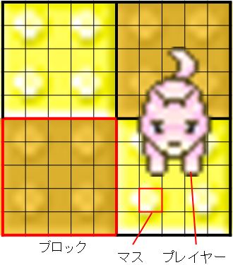

# JavaChallenge2015

## 概要

床を落として敵を落とせ！

## ルール

8ブロックx8ブロックの盤面上を動き、向いている方向の一列の床を落とすことが出来ます。
床ごと相手を落とし、最後まで生き残っていたプレイヤーが勝者となります。

### 初期状態

プレイヤーは4人です。初期配置位置と向きはランダムに決定され、各プレイヤーにはそれぞれ、0, 1, 2, 3 のIDが割り振られます。

### 盤面

盤面は 40マス×40マスで構成されます。
より正確には、5マス×5マスで構成された**ブロック**が、8ブロック×8ブロック並んで盤面を構成します。

### ターンの流れ

ゲームはID0のプレイヤーから開始され、ID0->ID1->ID2->ID3->ID0->... の順にターンが進み、ゲームが進行していきます。

自分のターンになると、各プレイヤーの位置情報および盤面の状態が与えられます。
プレイヤーは毎ターン、以下のいずれかの行動を1つだけ取ることができます。
- 上下左右のいずれかの方向に1マス移動する
- 向いている方向に攻撃を出す
- 何もしない

#### 移動

移動を行うと、上下左右いずれかの方向に_1マス_移動することができます。
移動後、プレイヤーの向きは移動した方向になります。

#### 移動のキャンセル

次の場合、移動はキャンセルされ、向きの変更のみが行われます。
- フィールドの外へ移動しようとした場合
- すでに落下しているブロックに移動しようとした場合
- 他のプレイヤーとのマンハッタン距離が7以下となるような移動を行った場合

#### 攻撃

攻撃を出した場合、今いるブロックの隣にあるブロックは次の自分のターン(4ターン後)に、
2つ隣のブロックは次の次の自分のターン(8ターン後)に、というように落下していきます。
このとき、落下するブロック上に相手がいれば、相手の残機を1減らすことができます。

### ブロックの復活

落下したブロックは5つ先の自分のターン、つまり20ターン後に復活します。

### ゲームの終了

自分以外のプレイヤーの残機をすべて0にすると勝利です。

## プレイヤーの入出力

### 準備完了メッセージの出力形式

ゲームを開始する準備ができたら、`READY`と標準出力に出力します。
ゲーム開始から5秒以内に出力がなければ、AIプログラムが強制的に停止されます。

### 入力形式

<pre>
id
T
L0 L1 L2 L3
B0,0 B0,1 B0,2 ... B0,39
B1,0 B1,1 B1,2 ... B1,39
...
B39,0 B39,1 B39,2 ... B39,39
R0 C0
R1 C1
R2 C2
R3 C3
EOD
</pre>

* id: プレイヤーID
* T: 現在のターン数
* Li: プレイヤーiの残り残機数。
* Br,c: 盤面のr行目c列目の状態。
 * 0の場合はパネルが存在し、落下する予定もない。
 * 正の数の場合は、そのターン数後に落下する。
 * 負の数の場合は、そのパネルは落下していて存在しない。その数の絶対値のターン数後にパネルが復活する。
* Ri: プレーヤーiが存在している行。負の数の場合は落下していて盤上に存在しないことを表す。
* Ci: プレーヤーiが存在している列。負の数の場合は落下していて盤上に存在しないことを表す。
* EOD: 入力の終わりを表す。

### 行動の出力形式

自分のターンになったら、以下のいずれかのコマンドを標準出力に出力します。
ターン開始から2秒以内に出力がなければ、AIプログラムが強制的に停止されます。

 * "U": 「上に1マス進む」という命令を出します。
 * "R": 「右に1マス進む」という命令を出します。
 * "D": 「下に1マス進む」という命令を出します。
 * "L": 「左に1マス進む」という命令を出します。
 * "A": 「向いている方向に攻撃を出す」という命令を出します。
 * "N": 「何もしない」という命令を出します。

### 出力時の注意

ゲーム開始時の`READY`やターンの行動を出力する際、最後に改行文字（`"\n"`）を付けてください。
また、出力後は標準出力をflushしてください。

